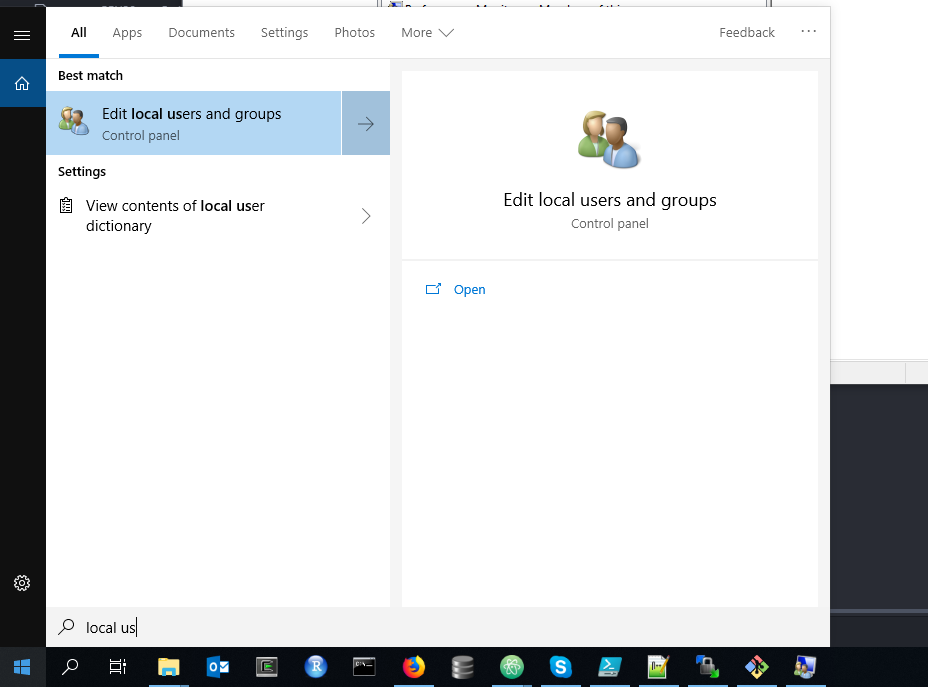
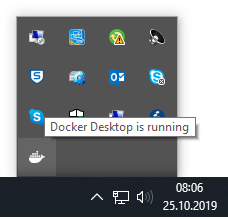

# LCMSprocessing pipeline.

The LCMS processing which has been developped has mainly been built for scalability and
efficiency, meaning that it supposed to be able to process thousands of samples and it should
extract them in a sensitive and reliable manner. However it was not design for user-friendliness.
If you want to manually inspect some small dataset, consider looking for compoundsDiscoverer or MZmine.

Therefore it is composed of different piece of software wrapped together, this to avoid installation, all the softwares are bundled together in a *Docker*.

A *Docker* is very similar to virtual machine from the user perspectives. However making docker work in the ETH infrastructure is difficult,and the first part of this tutorial is the installation.

## Installing docker

Docker can be installed following this [tutorial](https://runnable.com/docker/install-docker-on-windows-10).
The whole installation process should take less than 5 minutes. You need to restart your computer.

 You then need 2 things, first to add yourself to the docker-users group and increase the memory available to docker.

You then have to add yourself to the docker-user group of ETH to run Docker. At the moment you have to do it yourself, to do so log out of your session and log in the admin account of your computer (SYSBCPU) and find the local users group in the control panel :


Then on the windows click on the Groups folder in the middle panel, open the docker-users group. You  can then add yourself to the docker-users, using you ETH login (dalexis in my case). You can then

### Increasing processing power.
By default the docker virtual machine only take a small part of your computing power, however especially if you have a workstation. To do so right click on the docker icon at the right of your task bar :
 

And open the settings page :
 

The number of CPUs and the RAM will notably increase the speed of the peakpicking. One peakpicking experiment take 1.25Go of RAM approximately. After these modifications the docker engine will restart, which can take several minutes.

### Getting the workflow
The workflow is currently stored on the Docker Hub eventually and the majority of the data.

### Running the docker
Now that Docker is installed and setup you are ready to go. The LC-MS workflow take two directories as arguments, one which contains
your .mzML file (.mzML is the standard format used in the hyphenated MS world, you can convert your files in .mzML using the MSconvert software), and one empty folder which will store the data. If the processing stop or fail for any reasons, don t erase the results folder, relaunch it.


### Step 1 Running the docker a first time:
The docker needs two things run :
* An input directory containing the data to be processed, a bunch of .mzML files.
* An output directory, in this directory the parameters will be placed aswell as the

At the run time you also need to input your eth password to connect on sauer1 using your account.
The LCMS workflow can take as output data placed on the sauer1 *NAS* or on a local drive (C:). The sauer1 drive is by default mounted inside the docker under the path */sauer1*. A demo version on a small subset of data is included inside my sauer1 folder, to run it simply run :

```
docker run -it --cap-add=SYS_ADMIN --cap-add=DAC_READ_SEARCH --privileged -e INPUT=/sauer1/users/Alexis/examples_lcms_workflow/input -e OUTPUT=/sauer1/users/Alexis/examples_lcms_workflow/output -e USERNAME=dalexis adelabriere/lcms_workflow_zamboni:latest
```


### Step 3 : Running the docker.

The docker needs to be run with the following command.

docker run lcms_workflow_zamboni:latest -v ./input:/rawfiles/mzML -v ./output:/output

The docker run eventually the following ocmmand inside the following workflow


## What is inside this docker ?

The LCMS processing workflow incorporates three main steps :
- Peak picking using the MZmine workflow
- Peak alignment using an in-house aligner
- Peak feature annotations using the MScliques worklow.
- The MS-MS spectra are eventually output to be the majority of the daya.
